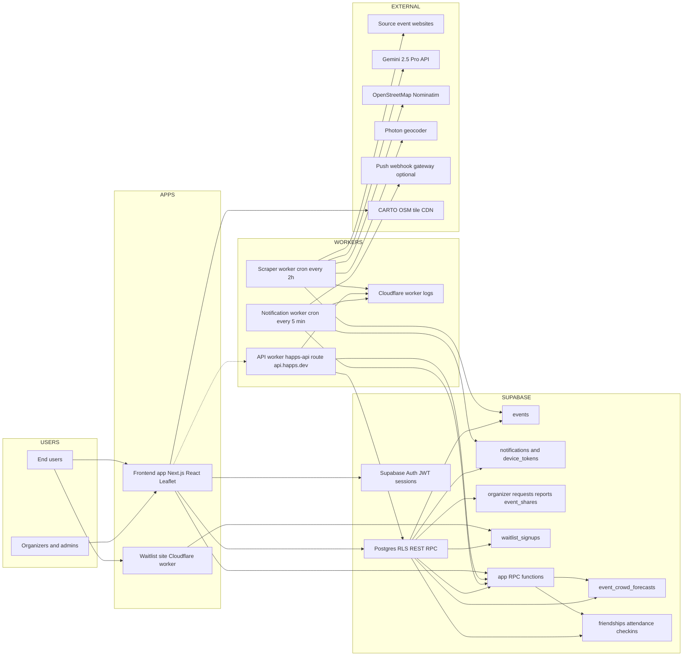

# Infrastructure Graph (Mid-Level)

Use this Mermaid diagram in the hackathon video to explain the full platform flow without going low-level into code internals.

If Mermaid still does not render in your editor:
- switch preview engine / reopen markdown preview once
- copy the Mermaid block into [mermaid.live](https://mermaid.live) (it should render there)
- keep using this file for narration even if local preview is flaky

## 60-second Narration Script (Optional)

1. Users interact with the Next.js app, which authenticates with Supabase and reads/writes event-social data through RLS-protected tables and RPCs.
2. A scheduled Cloudflare scraper worker ingests public event websites, uses Gemini for resilient structured extraction, geocodes locations, then writes normalized events into Supabase.
3. A second scheduled notification worker runs every 5 minutes to queue reminders, refresh crowd forecasts, expire stale check-ins, and optionally fan out push notifications via webhook.
4. A dedicated API worker exists on `api.happs.dev` for authenticated business actions and admin workflows when we want stricter edge mediation.
5. A separate waitlist worker captures pre-launch signups directly into Supabase, while the map UI uses external CARTO/OSM tiles.
